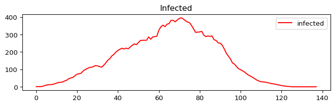

# TTIC
Disease spread simulation with cellular automaton.

## How to use?
Run application without preventions:
```sh
python3 -m simulaton
```

To run with preventions just run the same command with `--isolation`, `--mask` and/or `--vaccine` params.
```sh
python3 -m simulaton --isolation --mask --vaccine
```

In short:
```sh
python3 -m simulaton -i -m -v
```


## How to configure?
In simulation.config file, there are some variables that refers to disease/prevention probabilities.

Some examples: `PROB_INFECTION` indicates the disease infection probability.

## Outputs
### GIF with disease spread simulation
<p float="left">
  
</p>

### Graphs
<p float="left">
  
  
  
  
  
</p>

## Other works
This project is an evolution of Roger Vieira's solution in his article ["Modelo de propagação de doenças epidêmicas baseado em autômatos celular"](http://repositorio.unesc.net/handle/1/8862)
